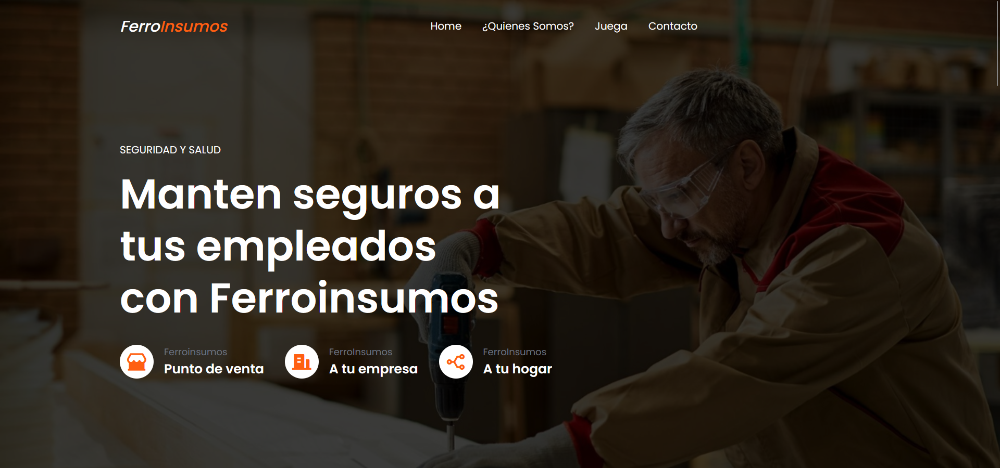

# Pagina Web FerroInsumos

## Descripción 

La página web de **FerroInsumos** se presenta como una solución moderna y eficiente para conectar a empresas y hogares con productos esenciales en construcción, herramientas, y seguridad laboral. Está estructurada para ofrecer una experiencia de usuario fluida, siguiendo estas características:

1. **Encabezado (Header):**
   - Incluye un logo llamativo y un menú de navegación claro con enlaces hacia las secciones principales: Inicio, ¿Quiénes Somos?, Juegos Interactivos y Contacto.
   - Presenta un llamado a la acción destacando la importancia de la seguridad y la calidad de los productos, acompañado de tres tarjetas que resaltan los métodos de venta: punto físico, a empresas y a hogares.
2. **Sobre Nosotros (About):**
   - Una sección con nuestra misión, visión y objetivo, enfatizando el compromiso de FerroInsumos con la construcción de sueños, la calidad de los productos y un servicio confiable.
3. **Video Informativo:**
   - Un video integrado y centrado, que explica la propuesta de valor de la empresa, mostrando la calidad de los productos y servicios.
4. **Sección Interactiva (Juegos):**
   - Una forma creativa de educar y entretener a los usuarios sobre herramientas y productos a través de actividades interactivas como Scratch y Kahoot, con acceso directo desde la página.
5. **Contacto (Banner de Cotización):**
   - Un formulario simple para que los clientes dejen su correo y reciban información sobre cotizaciones o visitas personalizadas.
6. **Pie de Página (Footer):**
   - Información sobre la empresa, enlaces rápidos a otras páginas de interés, y redes sociales para mantenerse conectados con FerroInsumos.

### Aspectos Visuales:

- **Colores:** Tonos predominantes en verde y negro, reforzando la identidad de marca.
- **Diseño:** Uso de íconos visuales y textos claros que guían al usuario de manera efectiva.
- **Responsividad:** Adaptada para una experiencia óptima en cualquier dispositivo.

La página de **FerroInsumos** no solo ofrece información sino también interacción y confianza, posicionándose como una herramienta clave para empresas y hogares en sus proyectos de construcción y seguridad.
